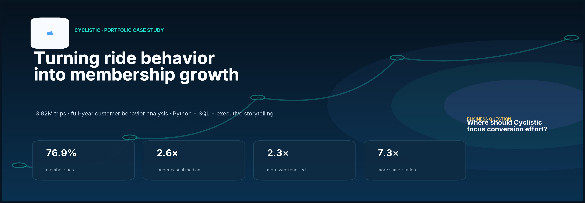
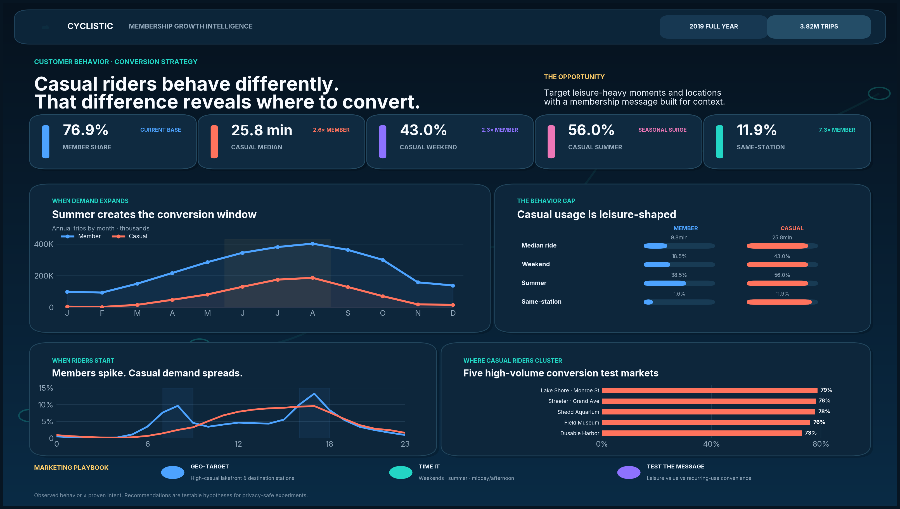
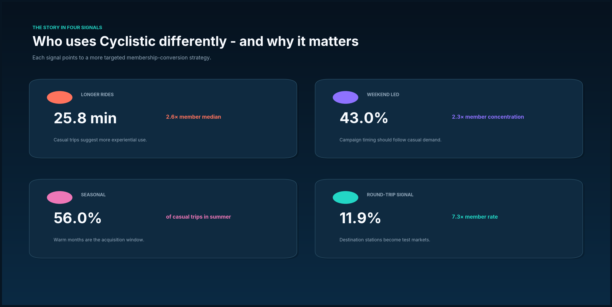
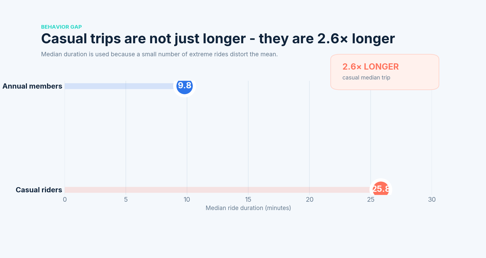
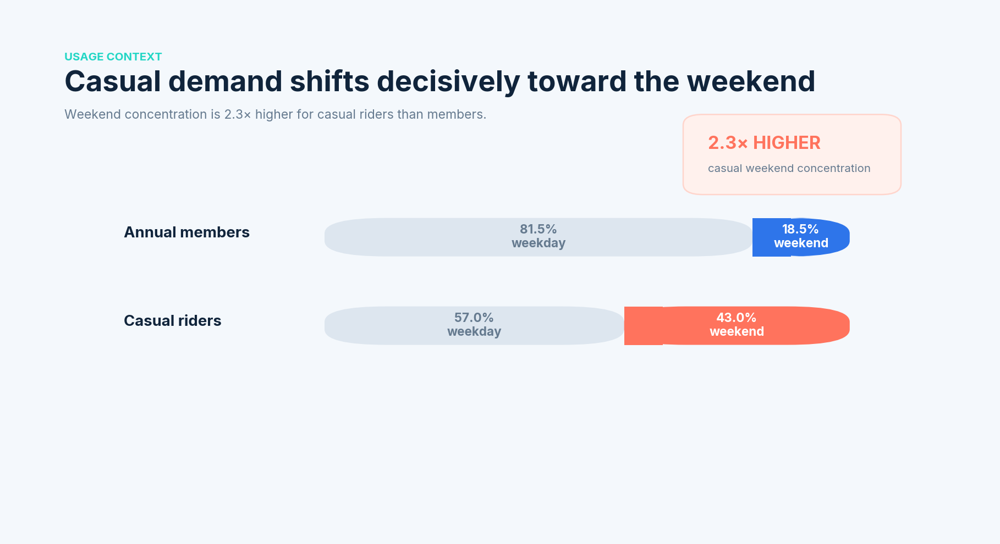
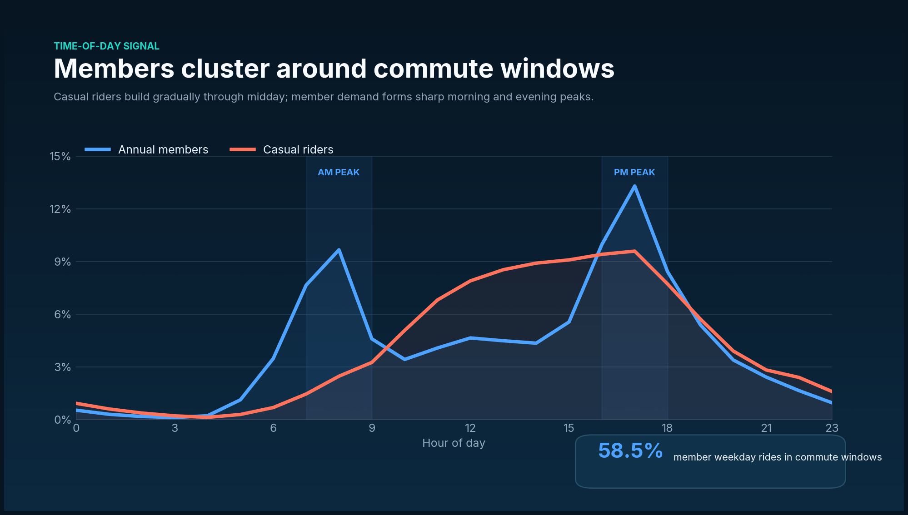
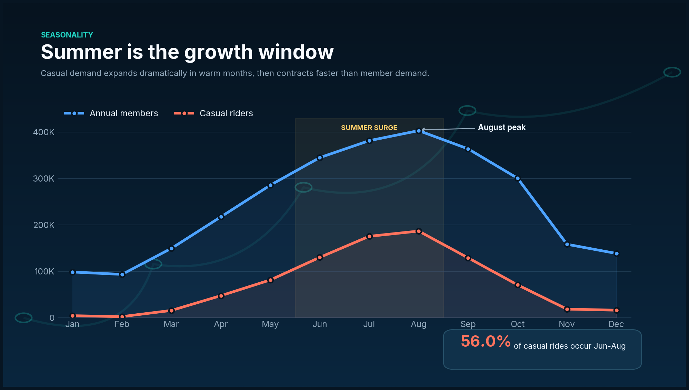
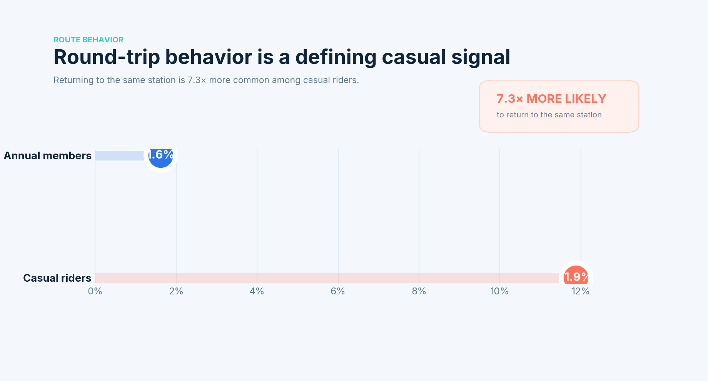
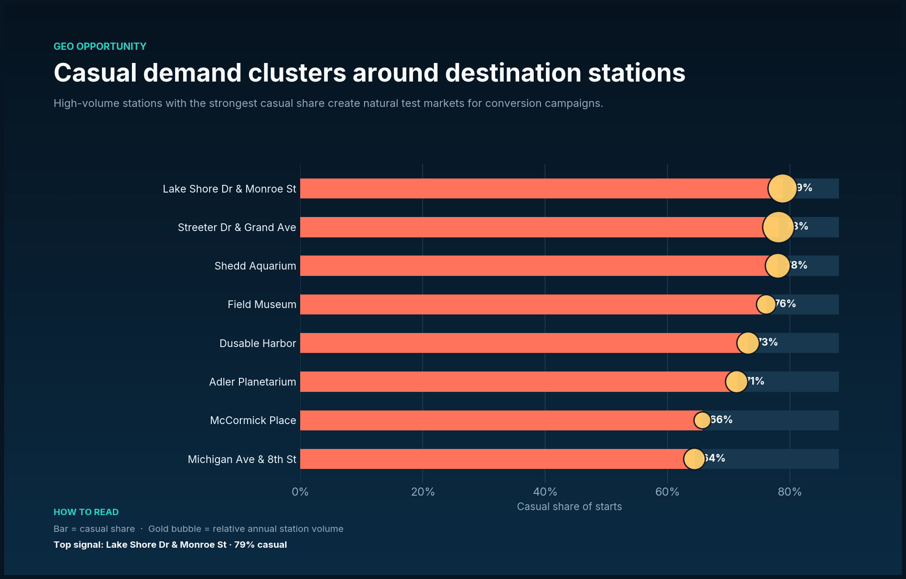

# Cyclistic Membership Conversion Analysis

**Google Data Analytics Capstone · Portfolio Edition**  
`Python` · `Pandas` · `NumPy` · `SQL` · `Data Quality` · `Behavioral Analytics` · `Executive Storytelling`

> **Executive thesis:** casual riders behave like a different use case. They ride longer, are much more weekend- and summer-oriented, and are far more likely to return to the same station. That means the strongest conversion strategy is **context-specific**: target the moments and locations where casual demand is already concentrated, then test the membership message experimentally.



**Interactive version:** open [`dashboard/index.html`](dashboard/index.html). It is fully self-contained, so all charts are embedded and render without external asset paths.

## Project at a glance

| Portfolio signal | What this project demonstrates |
|---|---|
| **Scale** | 3,818,004 trip records across a complete annual cycle |
| **Data engineering** | Schema harmonization across quarterly files, rider-type standardization, feature engineering |
| **Data quality** | Duplicate, timestamp, station, category and duration validation with documented treatments |
| **Analytics** | Customer mix, duration, weekday/weekend, seasonality, hourly profiles, route behavior, station concentration |
| **Business translation** | Every major finding is converted into a testable marketing implication |
| **Communication** | Executive dashboard, visual case-study report, notebook, SQL layer and decision narrative |



---

## The business question

Cyclistic wants to increase annual memberships. The analytical task is therefore not simply to describe ridership; it is to answer:

**How do annual members and casual riders use Cyclistic differently, and where do those differences create credible membership-conversion opportunities?**

The project deliberately separates **what the trip data proves** from **what it only suggests**. Time and station patterns can support behavioral hypotheses, but they cannot prove trip purpose or causality without rider-level campaign and conversion data.

---

## Why the analysis uses 2019

The supplied archive covers multiple years but contains gaps in the newer monthly files. **January-December 2019 is the most recent complete, uninterrupted 12-month period available in the supplied data.** Using a full year avoids missing-month seasonality bias and preserves a complete demand cycle.

| Source file | Rows |
|---|---:|
| Divvy Trips 2019 Q1 | 365,069 |
| Divvy Trips 2019 Q2 | 1,108,163 |
| Divvy Trips 2019 Q3 | 1,640,718 |
| Divvy Trips 2019 Q4 | 704,054 |
| **Total** | **3,818,004** |

Legacy rider labels are standardized as `Subscriber → member` and `Customer → casual`. Gender and birth-year fields are intentionally excluded because they are unnecessary for the business task.

---

## Data-quality decisions that matter

A portfolio project should show judgment, not just cleaning syntax.

### Daylight-saving anomaly retained, not deleted

The pipeline finds **13 rides on 3 November 2019** where subtracting local `end_time - start_time` produces a non-positive duration. That date coincides with the daylight-saving clock fallback. The source `tripduration` field remains positive, so the pipeline uses the source duration for those 13 records instead of discarding valid trips.

### Extreme-duration sensitivity handled explicitly

**1,849 rides exceed 24 hours.** They remain valid for ride-volume analysis but are flagged as duration outliers. This is why **median duration** is the headline duration KPI rather than an unqualified mean.

<details>
<summary><strong>Full quality audit</strong></summary>

| Check | Result | Treatment |
|---|---:|---|
| Raw trip records | 3,818,004 | Four quarterly 2019 files |
| Duplicate ride IDs | 0 | None required |
| Invalid timestamps | 0 | None required |
| Missing start station names | 0 | None required |
| Missing end station names | 0 | None required |
| Missing / unmapped rider type | 0 | None required |
| Non-positive calculated durations | 13 | Recovered using source duration |
| Rides >24 hours | 1,849 | Retained for counts; flagged for duration sensitivity |

</details>

---

# What the data says

## 1 · Casual trips are 2.6× longer



The median casual ride is **25.8 minutes**, compared with **9.8 minutes** for annual members. The result is robust to the extreme-duration issue because the primary comparison uses medians.

**Business signal:** casual users appear to consume the service differently enough that a generic member-style value proposition may be suboptimal.

## 2 · Casual demand is 2.3× more weekend-concentrated



**43.0%** of casual rides occur on weekends versus **18.5%** of member rides. Saturday is the casual segment's peak weekday, while Tuesday is the member segment's peak weekday.

**Business signal:** acquisition timing should follow casual demand rather than mirror member behavior.

## 3 · Members show sharper recurring-use time patterns



Among weekday rides, **58.5%** of member starts occur in the defined 7-9am and 4-6pm windows, versus **37.4%** for casual riders.

This pattern is **consistent with recurring weekday transportation**, but the dataset does not contain trip purpose, so the project does not label these trips as confirmed commutes.

## 4 · Summer is the acquisition window



**56.0%** of casual rides occur in June-August, compared with **38.5%** of member rides. Both segments peak in August, but casual demand contracts much more sharply outside warmer months.

**Business signal:** seasonal conversion campaigns can be concentrated when the casual pool is largest.

## 5 · Round-trip behavior separates casual riders sharply



Casual riders return to their starting station on **11.9%** of trips versus **1.6%** for members - a **7.3× difference**.

**Business signal:** route shape reinforces the case for different usage contexts and helps identify destination-oriented conversion moments.

## 6 · Casual opportunity is geographically concentrated



High-volume stations with especially strong casual share include:

- **Lake Shore Dr & Monroe St — 79% casual**
- **Streeter Dr & Grand Ave — 78% casual**
- **Shedd Aquarium — 78% casual**
- **Field Museum — 76% casual**
- **Dusable Harbor — 73% casual**

**Business signal:** these locations are natural test markets for localized conversion experiments.

---

# From insight to action

### 01 · Geo-target high-casual stations
Prioritize lakefront, museum and destination stations where casual usage is already dense. Test localized QR prompts, in-app messages and paid-social geofences rather than distributing spend evenly across the system.

### 02 · Time campaigns to casual demand
Concentrate acquisition around **weekends, summer and midday/afternoon casual windows**. Test a separate recurring-use message for casual riders who already appear during weekday commute-time windows.

### 03 · Segment the membership value proposition
Test **leisure-oriented value** against **convenience / recurring-use value**. Use privacy-safe A/B testing and measure incremental conversion rather than assuming that descriptive patterns automatically cause membership uptake.

| Test context | Treatment hypothesis | Primary measure |
|---|---|---|
| Weekend · high-casual station | Leisure value + conversion incentive | Membership conversion rate |
| Weekday · commute-time casual | Recurring-use convenience + membership economics | Incremental conversion lift |
| Control | Business-as-usual / generic message | Baseline conversion |

---

## Analytical workflow

```text
RAW DIVVY FILES
      ↓
SCHEMA HARMONIZATION
      ↓
DATA-QUALITY VALIDATION
      ↓
FEATURE ENGINEERING
      ↓
BEHAVIORAL ANALYSIS
      ↓
EXECUTIVE VISUALIZATION
      ↓
TESTABLE MARKETING ACTIONS
```

### Tools demonstrated

- **Python / Pandas / NumPy** — ingestion, harmonization, feature engineering, validation and aggregation
- **SQL** — business-facing aggregation and validation queries
- **Matplotlib** — custom executive visualizations and portfolio dashboard design
- **Git / GitHub** — reproducible repository structure and documentation
- **BI thinking** — KPI hierarchy, executive dashboard composition and campaign-test design

---

## Repository structure

```text
cyclistic_capstone_portfolio/
├── README.md
├── Cyclistic_Capstone_Portfolio_Report.pdf
├── requirements.txt
├── data/
│   └── core_source_manifest.csv
├── notebooks/
│   └── cyclistic_case_study.ipynb
├── src/
│   ├── analysis_pipeline.py
│   ├── visual_refresh.py
│   ├── dashboard_builder.py
│   ├── dashboard_design.py
│   ├── report_builder.py
│   ├── report_v2.html
│   └── report_cover.py
├── dashboard/
│   └── index.html
├── sql/
│   └── analysis_queries.sql
├── docs/
│   ├── executive_summary.md
│   ├── methodology.md
│   ├── data_dictionary.md
│   ├── powerbi_dashboard_blueprint.md
│   ├── visual_identity.md
│   └── interview_guide.md
└── outputs/
    ├── figures/          # Portfolio visuals used throughout this README
    └── summary_tables/   # Reusable CSV aggregates and quality audit
```

---

## Limitations

- The analysis window is historical; production decisions should refresh the same pipeline on a complete recent 12-month period.
- Data is trip-level, not rider-level, so repeat casual riders and eventual membership conversions cannot be identified.
- No campaign exposure, pricing sensitivity, weather, event or explicit trip-purpose data is available.
- Timing, route and station signals support **targeting hypotheses**, not causal claims about intent.

## Next analytical step

Move from descriptive segmentation to measured conversion lift: refresh the pipeline on a recent full year, connect privacy-safe campaign exposure to membership outcomes, run controlled experiments by segment, and estimate **incremental members and cost per incremental member**.
